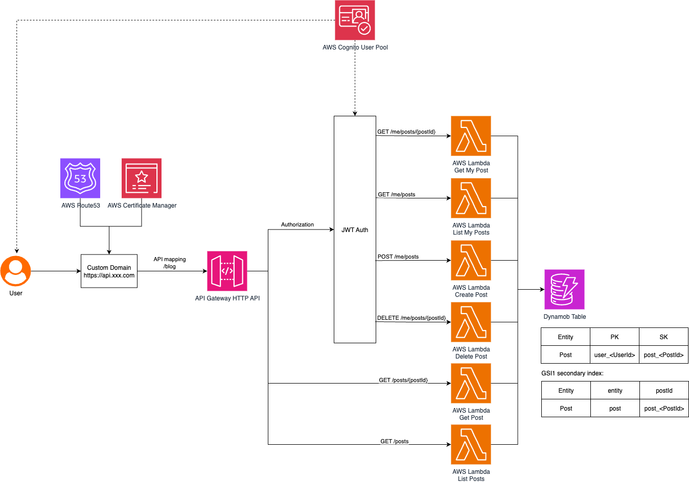

## Serverless TypeScript Best Practices

  

This is a simple serverless application built in TypesScript and uses Node.js 22 runtime. It leverages [Middy](https://middy.js.org/) as a middleware engine to compose modular and reusable Lambda handlers, and uses [Zod](https://zod.dev) for schema-based validation.

### Features

- **Schema validation & input extraction**: Validates and extracts body, params, and query using Zod and Middy.
- **User authentication**: Extracts userId(sub) from the request that is integrated with JWT auth.
- **Centralized error handling**: Handles and formats errors in a consistent way.
